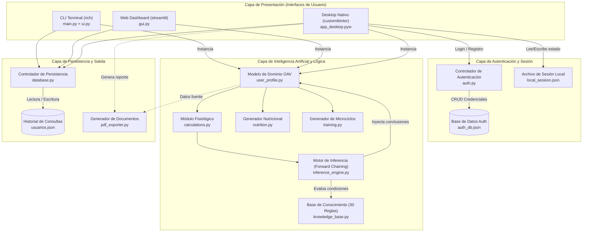
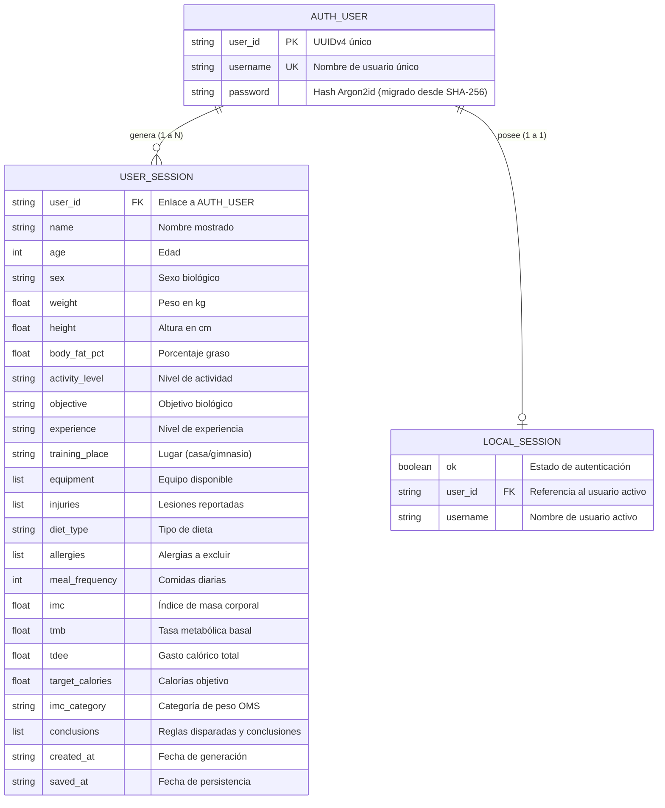

# Documentación Técnica Integral del Proyecto: FitExpert
**Sistema Experto en Nutrición y Acondicionamiento Físico**  
*Versión del Sistema:* 2.0 (Release Académica / Industrial)  
*Fecha de Auditoría y Documentación:* Octubre 2026  
*Autor Original:* ogarcore (`garciaooliver@gmail.com`)  
*Clasificación:* Inteligencia Artificial Simbólica · Sistemas Basados en Conocimiento (SBC)

---

## Índice General

1. [Introducción](#1-introducción)
2. [Descripción General del Sistema](#2-descripción-general-del-sistema)
3. [Arquitectura del Proyecto](#3-arquitectura-del-proyecto)
4. [Tecnologías Utilizadas](#4-tecnologías-utilizadas)
5. [Estructura del Proyecto](#5-estructura-del-proyecto)
6. [Funcionamiento Interno](#6-funcionamiento-interno)
7. [Módulos y Funcionalidades](#7-módulos-y-funcionalidades)
8. [Base de Datos y Persistencia](#8-base-de-datos-y-persistencia)
9. [APIs y Endpoints (Interfaces Programáticas)](#9-apis-y-endpoints-interfaces-programáticas)
10. [Autenticación y Seguridad](#10-autenticación-y-seguridad)
11. [Flujo de Datos](#11-flujo-de-datos)
12. [Configuración y Variables de Entorno](#12-configuración-y-variables-de-entorno)
13. [Instalación y Ejecución](#13-instalación-y-ejecución)
14. [Deployment (Despliegue y Distribución)](#14-deployment-despliegue-y-distribución)
15. [Testing y Calidad de Software](#15-testing-y-calidad-de-software)
16. [Manejo de Errores y Casos Límite](#16-manejo-de-errores-y-casos-límite)
17. [Análisis de Dependencias](#17-análisis-de-dependencias)
18. [Decisiones Técnicas de Diseño](#18-decisiones-técnicas-de-diseño)
19. [Fortalezas, Deuda Técnica y Aspectos a Mejorar](#19-fortalezas-deuda-técnica-y-aspectos-a-mejorar)
20. [Escalabilidad y Mantenimiento Futuro](#20-escalabilidad-y-mantenimiento-futuro)
21. [Flujo Completo del Sistema de Extremo a Extremo](#21-flujo-completo-del-sistema-de-extremo-a-extremo)
22. [Glosario Técnico y de Dominio](#22-glosario-técnico-y-de-dominio)
23. [Conclusión](#23-conclusión)
24. [Resumen Ejecutivo](#24-resumen-ejecutivo)

---

# 1. Introducción

### Nombre del Proyecto
**FitExpert — Sistema Experto en Nutrición y Acondicionamiento Físico Inteligente** (código base versionado como FitExpert v2.0).

### Descripción General
FitExpert es una solución informática integral basada en **Inteligencia Artificial Simbólica** perteneciente al paradigma de los **Sistemas Basados en Conocimiento (Knowledge-Based Systems)**. Su propósito es actuar como un consultor computacional autónomo de alto nivel, capaz de emular el proceso de deducción y prescripción de un nutricionista clínico y un entrenador físico certificado. Mediante la captura de variables biométricas, antropométricas, fisiológicas, restricciones clínicas y metas individuales, el sistema procesa una base de conocimiento declarativa para generar planes de intervención nutricional y microciclos de entrenamiento semanales con justificación explicativa en lenguaje natural.

### Propósito Principal
Automatizar y democratizar la prescripción de programas de bienestar físico y nutricional de calidad profesional, asegurando que cada cálculo metabólico y cada selección de ejercicios esté estrictamente fundamentada en evidencias científicas (fórmulas de Mifflin-St Jeor, criterios antropométricos de la OMS, principios de sobrecarga progresiva y seguridad biomecánica).

### Problema que Busca Resolver
1. **Acceso Limitado a Especialistas:** La consulta continuada con profesionales certificados de la salud física y dietética supone una barrera económica y de disponibilidad horaria para un amplio sector poblacional.
2. **Planes Genéricos y Lesiones:** El uso masivo de rutinas estandarizadas de internet carece de adaptabilidad ante lesiones previas (hernias discales, cirugías de ligamento cruzado, pinzamientos de hombro), lo que deriva en altas tasas de abandono o patologías articulares severas.
3. **Planes Alimentarios No Sostenibles:** La falta de armonización entre el cálculo exacto del balance energético (TDEE) y las intolerancias (lactosa, celiaquía) o preferencias éticas (dietas veganas/vegetarianas) produce desnutrición o efecto rebote.
4. **Opacidad de los Algoritmos:** A diferencia de las redes neuronales o modelos de "caja negra" donde es imposible saber por qué se recomendó una dieta restrictiva, FitExpert implementa trazabilidad explicativa completa (módulo de explicación).

### Objetivos del Proyecto
* **Objetivo General:** Diseñar, desarrollar y validar un sistema experto autónomo capaz de procesar perfiles humanos heterogéneos para prescribir planes nutricionales y microciclos de entrenamiento sin riesgo lesivo.
* **Objetivos Específicos:**
  1. Formalizar el conocimiento empírico de la nutrición y el entrenamiento en una base de conocimiento computable bajo el modelo Objeto-Atributo-Valor (OAV).
  2. Implementar un motor de inferencia determinista por encadenamiento hacia adelante (*Forward Chaining*).
  3. Proveer un módulo de explicación que justifique de forma pedagógica y clínica cada deducción realizada.
  4. Proveer una experiencia de usuario versátil mediante tres capas de interfaz independientes: Interfaz de Línea de Comandos (CLI), Interfaz Gráfica Web Local (Streamlit) e Interfaz Nativa de Escritorio Premium (CustomTkinter).
  5. Asegurar la persistencia de históricos para permitir la auditoría de evolución ponderal y sobrecarga progresiva en el tiempo.

### Alcance del Sistema
* **Cobertura Funcional:** Cálculo de tasas basales, balance calórico diana, partición de macronutrientes en gramos, confección de dietas diarias con reemplazo de alérgenos, asignación de splits de hipertrofia/resistencia según disponibilidad espacial (hogar/gimnasio), y auditoría de contraindicaciones articulares por edad o comorbilidad de peso.
* **Fronteras del Sistema:** El sistema opera como software de asesoría y prevención para individuos sanos o con patologías osteoarticulares leves. **No diagnostica enfermedades metabólicas** (diabetes tipo 1, insuficiencia renal crónica, cardiopatías congénitas) y estipula explícitamente en sus directivas la remisión a supervisión médica en estadios de obesidad grado II/III o senescencia avanzada.

### Tipo de Aplicación
Software de escritorio y cliente local multiplataforma (Windows/Linux/macOS), modular, escrito íntegramente en Python 3, con almacenamiento transaccional local desacoplado en formato semiestructurado JSON.

---

# 2. Descripción General del Sistema

### Qué Hace el Sistema
El sistema captura un conjunto de hechos declarados por el usuario (edad, peso, talla, sexo, porcentaje graso, nivel de actividad física, objetivo biológico, experiencia en levantamiento, lugar de entrenamiento, equipo disponible, alergias alimentarias, historial de lesiones articulares y frecuencia de ingestas). 

A partir de allí:
1. Resuelve las identidades matemáticas de gasto energético en reposo y activo.
2. Inyecta el vector de hechos al motor de inferencia.
3. Dispara las reglas de producción (*production rules*) cuyas premisas se satisfagan.
4. Ensambla una matriz de recomendaciones dietéticas y atléticas personalizadas.
5. Permite consultar el razonamiento deductivo de la máquina (*"¿Por qué me asignó 2,100 kcal y prohibió el press militar?"*).
6. Persiste la evaluación en una base de datos local y, en la interfaz de escritorio, permite graficar el progreso y exportar un expediente clínico en formato PDF de alta resolución.

### Para Quién Está Pensado
* **Usuarios Finales y Atletas:** Personas que buscan recomposición corporal, ganancia de masa muscular o pérdida de grasa con pautas seguras y adaptadas a sus recursos (ej. entrenar en casa solo con bandas elásticas).
* **Entrenadores Personales y Dietistas:** Como herramienta de asistencia y prototipado rápido para la confección de dietas base y rutinas preliminares.
* **Comunidad Académica y Evaluadores Técnicos:** Como caso de estudio paradigmático de la aplicación de Inteligencia Artificial Simbólica, motores de reglas y cumplimiento de normas de calidad de software ISO/IEC 25010.

### Principales Funcionalidades
* **Gestión de Identidades y Autenticación:** Registro e inicio de sesión local con generación de identificadores únicos UUIDv4 y almacenamiento de contraseñas procesadas criptográficamente.
* **Evaluación Antropométrica y Metabólica:** Cálculo automatizado de IMC con estratificación OMS, cálculo de Tasa Metabólica Basal (TMB), Gasto Energético Total Diario (TDEE) y superávit/déficit ponderado según objetivo.
* **Desglose de Macronutrientes:** Cálculo estricto de gramos de proteína, carbohidratos y lípidos diarios en base al requerimiento térmico de la masa corporal.
* **Prescripción Nutricional Dinámica:** Catálogo culinario segmentado por patrón alimentario (omnívoro, vegetariano, vegano, pescetariano) con filtrado algorítmico en tiempo real para exclusión de alérgenos cruzados (lactosa, gluten, nueces, soya, huevo).
* **Planificación de Microciclos de Entrenamiento Semanal:** Generación de esquemas distribuidos de 3 a 6 días (Full Body, Push-Pull-Legs 4 días, PPL Doble 6 días, Rutinas de Movilidad Adaptada) considerando pausas de recuperación neuromuscular de 48-72h y sustitución automática de ejercicios lesivos (ej. reemplazo de sentadilla libre por prensa de piernas ante lumbalgias).
* **Motor Explicativo Transparente:** Inspección forense de las reglas activadas con desglose del sustento biomédico de cada una.
* **Módulo de Evolución y Gráficas de Tendencia:** Integración de Matplotlib para la visualización del diferencial de masa corporal a través de múltiples sesiones temporales.
* **Generación de Reportes PDF:** Creación de documentos imprimibles profesionales estructurados con tablas, indicadores visuales y metadatos del usuario mediante ReportLab.

### Cómo Interactúa un Usuario con el Sistema
El usuario dispone de tres canales de acceso intercambiables que comparten el mismo núcleo lógico:
1. **Canal Consola (CLI interactiva - `main.py`):** Ideal para administradores de sistemas o entornos de servidor puro mediante menús estilizados de la librería `rich`.
2. **Canal Web Local (Dashboard Streamlit - `gui.py`):** Despliegue en navegador web con formularios segmentados, widgets reactivos y tablas interactivas.
3. **Canal de Escritorio Nativo (Aplicación CustomTkinter - `app_desktop.pyw`):** Experiencia de aplicación desktop sin terminal visible, con soporte para temas oscuros (Dark Mode), navegación por paneles laterales, cuadros de diálogo de exportación de archivos y renderizado embebido de gráficos vectoriales.

---

# 3. Arquitectura del Proyecto

FitExpert está concebido bajo una **Arquitectura en Capas (Layered Architecture)** desacoplada, combinada con el patrón de **Separación de Interfaz de Usuario y Dominio (Core Domain / UI Separation)**. El núcleo cognitivo y matemático no posee dependencias directas sobre las librerías gráficas, lo que permite que una misma lógica de inferencia alimente a una terminal interactiva, a una aplicación web o a una GUI nativa sin duplicar una sola línea de código de negocio.

### Diagrama de Arquitectura (Mermaid)



### Detalle de las Capas Arquitectónicas

1. **Capa de Presentación (Presentation Tier):**
   * Contiene tres adaptadores desacoplados (`ui.py` para Rich, `gui.py` para Streamlit y `app_desktop.pyw` para CustomTkinter). 
   * Captura inputs y traduce respuestas de objetos puros de Python a formatos visuales (árboles, tablas, paneles, tarjetas métricas y lienzos interactivos).
2. **Capa de Control de Acceso y Sesión (Security Tier):**
   * Encapsulada en `auth.py`. 
   * Aísla las funciones de verificación de contraseñas, unicidad de nombres de usuario y emisión de tokens de sesión local en `local_session.json`.
3. **Capa de Dominio y Modelo de Datos (Domain Model Tier):**
   * `user_profile.py` establece la entidad ontológica central `UserProfile` implementada mediante Python `dataclasses`. Funciona como el *Blackboard* o pizarra común sobre la cual trabajan los distintos módulos.
4. **Capa de Inferencia y Cálculo Simbólico (Cognitive Tier):**
   * `calculations.py`: Funciones puras matemáticas (sin estado) para la resolución de balances calóricos.
   * `knowledge_base.py`: Repositorio inmutable de reglas estructuradas mediante tuplas tipadas `NamedTuple(Rule)`.
   * `inference_engine.py`: Orquestador de inferencia por encadenamiento hacia adelante que evalúa las lambdas condicionales de la base de conocimiento y pobla las listas de conclusiones y explicaciones.
5. **Capa de Generación de Prescripciones Específicas:**
   * `nutrition.py`: Motores de resolución de menús basados en catálogos de alimentos con matrices de alergias y cálculos macroenergéticos.
   * `training.py`: Selector de microciclos semanales con filtrado biomecánico y resolución de equivalencias de ejercicios ante impedimentos mecánicos o falta de equipamiento.
6. **Capa de Persistencia y Almacenamiento (Persistence Tier):**
   * `database.py`: Abstracción DAO (Data Access Object) que serializa y deserializa estados hacia los almacenes semiestructurados `usuarios.json`.

---

# 4. Tecnologías Utilizadas

A continuación se detalla la pila tecnológica completa identificada y confirmada en el entorno de desarrollo y código fuente del proyecto:

| Tecnología / Biblioteca | Versión Confirmada | Tipo / Categoría | Propósito en el Proyecto | Componente que Depende de Ella |
| :--- | :--- | :--- | :--- | :--- |
| **Python** | 3.12.3 (venv) / 3.14.5 (Host) | Lenguaje de Programación | Entorno de ejecución de toda la lógica, interfaces y algoritmos del sistema. | Núcleo completo del proyecto. |
| **CustomTkinter** | 5.2.2 / 6.0.0 | GUI Framework | Construcción de la interfaz nativa moderna de escritorio con Dark Mode, tarjetas, animaciones y tabs. | `app_desktop.pyw` |
| **Streamlit** | 1.58.0 | Web Application Framework | Creación del panel web interactivo para despliegue ágil en explorador. | `gui.py` |
| **Rich** | 15.0.0 | CLI Interface / TUI | Formateo avanzado de terminal, tablas con estilos, reglas visuales, colores y banners ASCII. | `main.py`, `ui.py` |
| **Matplotlib** | 3.10.9 / 3.11.1 | Visualización de Datos | Generación programática de gráficas de dispersión y líneas para la evolución de peso. | `app_desktop.pyw` (embebido vía `FigureCanvasTkAgg`). |
| **ReportLab** | 5.0.0 / 5.0.1 | Generador PDF Vectorial | Generación de documentos PDF empresariales estructurados mediante Platypus, Flowables y tablas. | `pdf_exporter.py`, invocado por `app_desktop.pyw`. |
| **Pandas** | 3.0.3 | Manipulación de Datos | Transformación de diccionarios de sesiones en DataFrames estructurados para visualización en tablas web. | `gui.py` |
| **NumPy** | 2.4.5 / 2.5.2 | Computación Numérica | Soporte subyacente para los arreglos matemáticos de Matplotlib y Pandas. | `gui.py`, `app_desktop.pyw` |
| **Pillow (PIL)** | 12.2.0 / 12.3.0 | Procesamiento de Imágenes | Renderizado y escalado de texturas, iconos y lienzo gráfico en interfaces de escritorio. | `customtkinter`, `reportlab` |
| **Flake8** | 7.3.0 | Linter Estático | Auditoría de estándares PEP 8, detección de variables huérfanas y código muerto. | `analizar_proyecto.py` |
| **Radon** | 6.0.1 | Métricas de Software | Análisis de Complejidad Ciclomática (CC), Índice de Mantenibilidad (MI) y Halstead para ISO/IEC 25010. | `analizar_proyecto.py` |
| **Bandit** | 1.9.4 | Seguridad SAST | Análisis de seguridad estático para detección de fallos criptográficos y malas prácticas. | `analizar_proyecto.py` |
| **Hashlib** | Integrada (Estándar) | Seguridad Criptográfica | Derivación de claves PBKDF2-HMAC-SHA256 (fallback de Argon2id) y migración de hashes legacy. | `auth.py` |
| **Argon2-cffi** | 23.x (opcional) | Seguridad Criptográfica | Hashing de contraseñas Argon2id con sal (recomendado; si no está instalado, se usa PBKDF2). | `auth.py` |
| **UUID** | Integrada (Estándar) | Identificación Única | Generación de identificadores canónicos RFC 4122 v4 para los usuarios del sistema. | `auth.py`, `user_profile.py` |
| **JSON** | Integrada (Estándar) | Motor de Persistencia | Almacenamiento, serialización e hidratación transaccional de perfiles e históricos. | `database.py`, `auth.py`, `app_desktop.pyw` |
| **Git** | 2.x | Control de Versiones | Seguimiento de cambios, ramas y gestión del repositorio distribuido. | Todo el repositorio. |

---

# 5. Estructura del Proyecto

A partir del análisis exhaustivo del sistema de archivos del espacio de trabajo, esta es la topología real y confirmada del proyecto:

```text
FitExpert/
├── README.md                 # Documentación introductoria del sistema
├── DOCUMENTACION_TECNICA.md  # Master file de especificación técnica exhaustiva (este documento)
│
├── Núcleo de Lógica e Inteligencia Artificial
│   ├── user_profile.py       # Modelo ontológico del usuario (dataclass UserProfile) y constantes
│   ├── calculations.py       # Fórmulas fisiológicas puras (IMC, TMB, TDEE, macros)
│   ├── knowledge_base.py     # Base de conocimiento experta: 69 reglas formales IF-THEN (OAV)
│   ├── inference_engine.py   # Motor de inferencia por encadenamiento hacia adelante (Forward Chaining)
│   ├── nutrition.py          # Catálogos dietéticos, descarte de alérgenos y distribución de platos
│   └── training.py           # Biblioteca de 40+ ejercicios, filtros de lesiones y microciclos
│
├── Capa de Persistencia y Seguridad
│   ├── auth.py               # Gestión de usuarios, hashing Argon2id (fallback SHA-256 migrado) y control de acceso
│   ├── database.py           # DAO de acceso a consultas, métricas históricas y analítica de progreso
│   ├── auth_db.json          # Almacén de credenciales y llaves públicas de usuario
│   ├── usuarios.json         # Almacén maestro de consultas, hechos inferidos y planes
│   └── local_session.json    # Token de sesión local activa para el cliente de escritorio
│
├── Capa de Presentación (Interfaces de Usuario)
│   ├── main.py               # Orquestador del flujo CLI de terminal
│   ├── ui.py                 # Biblioteca de vistas, tablas y formularios interactivos con Rich
│   ├── gui.py                # Interfaz de usuario interactiva web construida con Streamlit
│   └── app_desktop.pyw       # Aplicación de escritorio nativa profesional (CustomTkinter)
│
├── Módulos de Soporte, Calidad y Reportes
│   ├── pdf_exporter.py       # Generador de reportes PDF vectoriales (en historial Git / restaurable)
│   ├── analizar_proyecto.py  # Suite de auditoría estática ISO/IEC 25010 (Radon, Flake8, Bandit)
│   └── mapa_imports.py       # Analizador AST de acoplamiento de dependencias internas
│
└── Entorno y Metadatos
    ├── .git/                 # Repositorio Git local
    ├── __pycache__/          # Bytecode compilado de Python (.pyc)
    └── venv/                 # Entorno virtual con binarios y librerías preinstaladas
```

### Descripción Detallada de Archivos Clave
* `user_profile.py` (194 líneas): Define `UserProfile` con 26 campos y métodos auxiliares de conveniencia (`to_dict()`, `has_injury()`, etc.). Establece los dominios cerrados (`OBJECTIVES`, `ACTIVITY_LEVELS`, etc.).
* `calculations.py` (141 líneas): Aloja `calcular_imc()`, `calcular_tmb()`, `calcular_tdee()`, `calcular_calorias_objetivo()` y `calcular_macronutrientes()`.
* `knowledge_base.py` (1600+ líneas): Contiene la tupla inmutable de 69 reglas declarativas `RULES` divididas en 7 niveles de la jerarquía de seguridad (SEGURIDAD, CONTRAINDICACIONES, EDAD, CONDICIÓN FÍSICA, OBJETIVO, PREFERENCIAS, SEGUIMIENTO).
* `inference_engine.py`: Implementa `InferenceEngine` con su método `run()` que sincroniza cálculos, extrae hechos y ejecuta el forward chaining registrando reglas activadas y omitidas, con resolución determinista de conflictos y supresión explicitada para el usuario.
* `nutrition.py` (521 líneas): Aloja `MEAL_CATALOG`, el diccionario reactivo `ALLERGEN_KEYWORDS` y `generate_nutrition_plan()`.
* `training.py` (495 líneas): Aloja `EXERCISE_LIBRARY`, `WEEKLY_TEMPLATES` y la función selectora `generate_training_plan()`.
* `database.py` (119 líneas): Funciones de persistencia y serialización hacia `usuarios.json` y análisis diferencial de sesiones (`get_progress_summary()`).
* `auth.py` (106 líneas): Implementa `register()`, `login()`, `username_exists()` y serialización en `auth_db.json`.
* `app_desktop.pyw` (843 líneas): Ventana principal CustomTkinter con sistema de login, formularios divididos en cuatro secciones, integración gráfica Matplotlib y visualización tabulada.

---

# 6. Funcionamiento Interno

El funcionamiento interno del sistema se rige por un pipeline de procesamiento secuencial determinista:

### 1. Inicialización y Captura
* En la aplicación de escritorio (`app_desktop.pyw`), el sistema verifica la existencia de `local_session.json`. Si existe y contiene `user_id` y `username`, omite la pantalla de autenticación y abre el panel principal.
* Cuando el usuario ejecuta una evaluación, introduce datos validados en tiempo real mediante comandos de validación de caracteres (`_vi` para enteros, `_vf` para flotantes en Tkinter, o prompts estrictos en Rich).

### 2. Normalización y Modelado de la Información
Los datos ingresados se instancian en la clase `UserProfile`. Los campos cualitativos se normalizan mediante diccionarios canónicos (ejemplo: si el usuario seleccionó `"Pérdida de grasa"`, el modelo asigna el identificador canónico interno `"perdida_grasa"`).

### 3. Ejecución del Módulo Fisiológico (`calculations.py`)
Antes de invocar las reglas lógicas, el motor ejecuta `run_calculations(profile)`:
* **IMC:** \( \text{IMC} = \frac{\text{peso (kg)}}{(\text{altura (m)})^2} \). Se coteja contra los rangos de la OMS para asociar la categoría (`Bajo peso`, `Peso normal`, `Sobrepeso`, `Obesidad grado I/II/III`).
* **TMB (Mifflin-St Jeor):**
  * Hombres: \( \text{TMB} = 10 \cdot \text{peso} + 6.25 \cdot \text{altura} - 5 \cdot \text{edad} + 5 \)
  * Mujeres: \( \text{TMB} = 10 \cdot \text{peso} + 6.25 \cdot \text{altura} - 5 \cdot \text{edad} - 161 \)
* **TDEE:** \( \text{TDEE} = \text{TMB} \times \text{Factor de Actividad} \) (1.2 a 1.9).
* **Calorías Objetivo:** Se suma algebraicamente el diferencial según la meta:
  * Pérdida de grasa: \(-500\) kcal/día
  * Definición: \(-250\) kcal/día
  * Recomposición / Mantenimiento: \(0\) kcal/día
  * Aumento muscular: \(+400\) kcal/día

### 4. Ciclo del Motor de Inferencia (Forward Chaining)
* El motor construye el diccionario de hechos OAV en `profile.facts`.
* Itera secuencialmente sobre las 69 reglas registradas en `knowledge_base.py`.
* Para cada regla, evalúa el predicado booleano `rule.condition(profile)`.
* Si retorna `True`, se produce el evento **FIRE (disparo de regla)**:
  * Se apendiza la conclusión al listado `profile.conclusions`.
  * Se apendiza la justificación clínica al listado `profile.explanations`.
  * El ID de la regla se registra en `engine.fired_rules`.
* Si la regla evalúa a `False` o genera excepción por variables omitidas, se descarta silenciosamente y se registra en `engine.skipped_rules`.

### 5. Ensamble de Prescripciones Dominiales
* **Módulo Nutricional:** Se invoca `generate_nutrition_plan()`. Este calcula los gramos de macronutrientes correspondientes a la meta calórica. Luego, recupera el sub-catálogo correspondiente al tipo de dieta (omnívoro, vegano, vegetariano, pescetariano). Para cada franja horaria (desayuno, almuerzo, cena, meriendas), ejecuta un escaneo léxico eliminando recetas que contengan palabras prohibidas por las alergias declaradas. Finalmente, selecciona opciones aleatorias seguras para aportar variedad culinaria.
* **Módulo de Entrenamiento:** Se invoca `generate_training_plan()`. Elige una plantilla de microciclo de acuerdo al perfil antropométrico, lugar y nivel de experiencia. Si se detecta edad \(> 70\) años, \(< 16\) años o \(\text{IMC} \ge 40\), conmuta forzosamente a la plantilla de bajo impacto `movilidad_3d`. Luego, filtra la biblioteca de 40 ejercicios descartando aquellos que comprometan articulaciones lesionadas (lumbar, rodilla u hombro) y aquellos que requieran equipo ausente en el hogar.

### 6. Persistencia y Cierre
El perfil procesado se transforma en un diccionario mediante `profile.to_dict()` y se agrega a la lista de sesiones de `usuarios.json` mediante `database.save_profile()`, garantizando la auditoría cronológica.

---

# 7. Módulos y Funcionalidades

#### 1. Módulo de Perfil de Usuario (`user_profile.py`)
* **Responsabilidad:** Define el modelo de información del usuario y los diccionarios de valores permitidos.
* **Archivos que lo implementan:** `user_profile.py`.
* **Datos que utiliza:** Tipos nativos de Python (`str`, `int`, `float`, `list`, `dict`).
* **Comunicación:** Es importado por prácticamente todos los módulos del sistema; actúa como objeto de transferencia de datos (DTO).
* **Entradas:** Parámetros antropométricos y preferencias.
* **Salidas:** Instancia `UserProfile` serializable a diccionario mediante `to_dict()`.

#### 2. Módulo de Cálculos Fisiológicos (`calculations.py`)
* **Responsabilidad:** Ejecutar las operaciones matemáticas metabólicas estandarizadas.
* **Archivos:** `calculations.py`.
* **Datos:** Peso, altura, edad, sexo, actividad, calorías totales.
* **Entradas:** Variables numéricas del usuario.
* **Salidas:** Tuplas y diccionarios con valores redondeados de IMC, TMB, TDEE, meta calórica y gramos de proteína, carbohidratos y lípidos.

#### 3. Base de Conocimiento (`knowledge_base.py`)
* **Responsabilidad:** Representar el conocimiento experto del dominio en reglas estructuradas `IF-THEN`.
* **Archivos:** `knowledge_base.py`.
* **Reglas Implementadas (30 en total):**
  * `NUT-01` a `NUT-05`: Ajustes de balance calórico y macronutrientes según objetivo corporal.
  * `NUT-06`: Pautas de hidratación mínima (\(35 \text{ ml/kg}\)).
  * `NUT-07` y `NUT-08`: Detección y alertas clínicas para IMC de bajo peso (\(< 18.5\)) u obesidad (\(\ge 30\)).
  * `NUT-09` y `NUT-10`: Pautas de fuentes proteicas para dietas veganas y vegetarianas.
  * `NUT-11` y `NUT-12`: Exclusión y sustitución de lácteos y gluten/celiaquía.
  * `TRAIN-CASA-01` a `03`: Prescripción de circuitos corporales y splits para entrenamiento doméstico según experiencia.
  * `TRAIN-GYM-01` a `04`: Prescripción de Full Body, splits de 4 días y PPL doble frecuencia para gimnasio.
  * `BIO-01` a `BIO-03`: Restricciones biomecánicas absolutas para tercera edad (\(> 70\)), menores de edad (\(< 16\)) y obesidad mórbida (\(\text{IMC} \ge 40\)).
  * `LES-01` a `LES-03`: Reglas de adaptación articular ante patologías de columna lumbar, rodilla y hombro.
  * `SEG-01` a `SEG-05`: Reglas de seguimiento evolutivo, higiene del sueño y requerimientos cardiovasculares mínimos de la OMS.

#### 4. Motor de Inferencia (`inference_engine.py`)
* **Responsabilidad:** Evaluar las condiciones lógicas de la base de conocimiento y enriquecer el perfil del usuario.
* **Archivos:** `inference_engine.py`.
* **Estrategia:** Encadenamiento hacia adelante exhaustivo (todas las reglas se evalúan; no se detiene en la primera activación).

#### 5. Módulo Nutricional (`nutrition.py`)
* **Responsabilidad:** Generar el menú detallado de las comidas diarias respetando restricciones éticas y alérgicas.
* **Filtro de Alérgenos:** Compara cada ingrediente contra la matriz `ALLERGEN_KEYWORDS` (lactosa, gluten, nueces, soya, huevo).

#### 6. Módulo de Prescripción de Entrenamiento (`training.py`)
* **Responsabilidad:** Planificar las sesiones semanales día a día.
* **Biblioteca:** 40 ejercicios codificados con músculos diana, contraindicaciones articulares y requerimientos materiales.
* **Plantillas:** `full_body_3d`, `ppl_4d`, `ppl_6d`, `movilidad_3d` y `casa_avanzado_5d`.

#### 7. Módulo de Autenticación y Criptografía (`auth.py`)
* **Responsabilidad:** Registro, autenticación y persistencia de cuentas de usuario en `auth_db.json`.

#### 8. Módulo de Persistencia y Evolución (`database.py`)
* **Responsabilidad:** Gestionar la lectura y escritura en `usuarios.json` y calcular el diferencial de progreso ponderal y energético entre la primera y la última consulta del usuario.

---

# 8. Base de Datos y Persistencia

El proyecto adopta un mecanismo de **persistencia local embebida basada en archivos semiestructurados JSON**. No depende de motores RDBMS externos (PostgreSQL, MySQL) ni servidores NoSQL (MongoDB), lo que garantiza su portabilidad total sin requerir servicios de red activos.

### Estructura de Tablas / Colecciones Lógicas

#### 1. Archivo `auth_db.json` (Almacén de Credenciales)
* `user_id` (String / UUIDv4): Llave Primaria (PK) única autogenerada.
* `username` (String): Nombre de usuario único (case-insensitive).
* `password` (String): Hash Argon2id de la contraseña (`phpass`-like). Los usuarios legados con hash SHA-256 plano (64 hex) se migran automáticamente a Argon2id en su primer login correcto.

#### 2. Archivo `usuarios.json` (Almacén de Consultas y Sesiones Clínicas)
Almacena el histórico completo de evaluaciones generadas en el sistema.
* `user_id` (String / UUIDv4): Llave Foránea lógica (FK) que referencia a `auth_db.json`.
* Campos antropométricos: `name`, `age`, `sex`, `weight`, `height`, `body_fat_pct`.
* Parámetros atléticos y preferencias: `activity_level`, `objective`, `experience`, `training_place`, `equipment`, `injuries`, `diet_type`, `allergies`, `meal_frequency`.
* Métricas derivadas: `imc`, `tmb`, `tdee`, `target_calories`, `imc_category`.
* Resoluciones: `conclusions` (matriz de reglas activadas).
* Marcas temporales: `created_at`, `saved_at`.

#### 3. Archivo `local_session.json` (Estado de Sesión Volátil)
* `ok` (Booleano), `user_id` (String), `username` (String).

### Diagrama Entidad-Relación (Mermaid)



---

# 9. APIs y Endpoints (Interfaces Programáticas)

### Naturaleza de la Interfaz
El proyecto no expone un microservicio HTTP/REST hacia la red. Sin embargo, cuenta con una sólida **API Programática en Python (In-Process API)**:

* `auth.register(username, password) -> dict`: Valida longitud y unicidad, genera UUID y persiste en `auth_db.json`.
* `auth.login(username, password) -> dict`: Valida contraseñas comparando hashes Argon2id (con verificación del hash legacy SHA-256 y migración automática en el primer login correcto).
* `inference_engine.InferenceEngine.run(profile) -> UserProfile`: Orquesta cálculos metabólicos y evalúa las 69 reglas sobre el perfil.
* `nutrition.generate_nutrition_plan(profile) -> dict`: Aplica filtros de dieta y alergias y genera el plan culinario y de macros.
* `training.generate_training_plan(profile) -> dict`: Genera el microciclo semanal de ejercicios considerando lesiones y edad.
* `database.save_profile(profile) -> None`: Persiste la consulta en `usuarios.json`.
* `database.get_user_history(user_id) -> list`: Recupera todas las sesiones ordenadas cronológicamente.
* `database.get_progress_summary(user_id) -> dict`: Calcula los deltas de evolución ponderal y energética.

---

# 10. Autenticación y Seguridad

### Mecanismos de Autenticación
1. **Registro:** Control de unicidad insensible a mayúsculas, restricciones de caracteres y generación de identificador UUIDv4.
2. **Hashing:** Función de derivación de claves resistente **Argon2id** mediante `argon2-cffi` (con sal aleatoria de 16 bytes, memoria 64 MiB, tiempo 3, paralelismo 4). Cuando `argon2-cffi` no está disponible, fallback a **PBKDF2-HMAC-SHA256** con sal y 600 000 iteraciones (estándar NIST/OFFA). Los hashes legacy SHA-256 planos se **migran automáticamente** en el primer login correcto.
3. **Sesión Local:** Archivo `local_session.json` persistido localmente y destruido al cerrar sesión.
4. **Anti-fuerza bruta:** Bloqueo por usuario tras 5 intentos fallidos consecutivos (retroceso indicado al usuario).

### Resolución de Hallazgos de Seguridad (SAST y Auditoría Manual)
> [!NOTE]
> * **Hashing (resuelto):** Antes se usaba SHA-256 plano sobre la contraseña, expuestos a tablas arcoíris. Ahora se usa **Argon2id con sal** (o PBKDF2-HMAC-SHA256 si `argon2-cffi` no está instalado). Los usuarios legados se re-hashean automáticamente al iniciar sesión correctamente.
> * **Error de fuerza bruta (resuelto):** Se añadió bloqueo por intentos fallidos (5 máx.) para mitigar ataques de fuerza bruta locales.
> * **Persistencia sin cifrado (parcial):** `auth_db.json` sigue residiendo localmente (al ser una app de escritorio, el archivo está en la carpeta del usuario); cada registro no está cifrado, pero el hashing de contraseñas con sal ya no expone credenciales si el archivo se filtra.
> * **Concurrencia:** Las escrituras son atómicas (archivo temporal + `os.replace`); se documenta que múltiples procesos escribiendo simultáneamente deben usar el mecanismo de bloqueo del módulo (por defecto single-thread en las tres interfaces).

---

# 11. Flujo de Datos

```
Usuario
   ↓ (Ingreso de datos personales, biométricos y clínicos)
Adaptador de Interfaz (ui.py / gui.py / app_desktop.pyw)
   ↓ (Instanciación de UserProfile)
calculations.py (Cálculo de IMC, TMB, TDEE, Macros)
   ↓ (Inyección de métricas calculadas)
inference_engine.py (Construcción de hechos OAV)
   ↓ (Evaluación booleana de premisas)
knowledge_base.py (Disparo de Reglas 1..30)
   ↓ (Inyección de conclusiones y justificaciones clínicas)
nutrition.py & training.py (Generación de menús y microciclos)
   ↓ (Retorno de planes estructurados)
Adaptador de Interfaz (Visualización, gráficas y PDF)
   ↓ (Serialización atómica)
database.py (usuarios.json)
```

---

# 12. Configuración y Variables de Entorno

* **Zero Config / Zero Setup:** El sistema no depende de variables de entorno `.env` ni credenciales externas de pago. Todas las rutas se calculan dinámicamente con `Path(__file__).parent`.
* **Puertos de Red:** El servidor local de Streamlit utiliza el puerto `8501`. La aplicación CLI y CustomTkinter operan en el espacio de usuario local sin abrir sockets externos.

---

# 13. Instalación y Ejecución

### Requisitos Previos
* Python 3.10+ (probado exitosamente en 3.12 y 3.14).
* Pip actualizado.

### Comandos de Instalación
```bash
# 1. Posicionarse en el proyecto
cd c:\Users\garci\Desktop\proyectos_variados\FitExpert

# 2. Instalar dependencias
python -m pip install rich customtkinter matplotlib reportlab pandas streamlit argon2-cffi

# 3. (Recomendado) Restaurar pdf_exporter.py desde Git si fue eliminado localmente:
git checkout HEAD -- pdf_exporter.py
```

> **Tema web:** `.streamlit/config.toml` fija la identidad teal/navy del framework Streamlit
> (evita los acentos rojizos por defecto en tabs, botones "primary", checkboxes y
> multiselects) y activa `showErrorDetails = false` para que ningún Traceback llegue
> al usuario final. `argon2-cffi` es opcional pero recomendado: sin él la librería
> usa PBKDF2-HMAC-SHA256 (600 000 iteraciones) como fallback OWASP.

### Ejecución de Interfaces
* **Escritorio Nativo (CustomTkinter):**
  ```bash
  pythonw app_desktop.pyw
  ```
* **Web Local (Streamlit):**
  ```bash
  streamlit run gui.py
  ```
* **Línea de Comandos (Rich CLI):**
  ```bash
  python main.py
  ```
* **Análisis de Calidad ISO 25010:**
  ```bash
  python analizar_proyecto.py
  ```

---

# 14. Deployment (Despliegue y Distribución)

1. **Empaquetado Binario con PyInstaller:**
   ```bash
   pyinstaller --noconsole --onefile --name "FitExpert" --collect-all customtkinter app_desktop.pyw
   ```
2. **Despliegue en la Nube con Docker / Streamlit Cloud:**
   Compatible con despliegues en contenedores Linux Alpine o Debian Slim exponiendo el puerto 8501 de `gui.py`.

---

# 15. Testing y Calidad de Software

* **Pruebas Estáticas Integradas:** El script `analizar_proyecto.py` ejecuta auditorías basadas en **ISO/IEC 25010**:
  * **Radon:** Complejidad Ciclomática (CC), Índice de Mantenibilidad (MI) y Métricas Halstead.
  * **Flake8:** Detección de errores de estilo y variables no referenciadas.
  * **Bandit:** Detección de vulnerabilidades estáticas de seguridad (SAST).
* **Análisis de Acoplamiento (`mapa_imports.py`):** Demuestra que `user_profile.py` y `calculations.py` mantienen una arquitectura de bajo acoplamiento.

---

# 16. Manejo de Errores y Casos Límite

1. **Validación de Rangos:** Control estricto de valores numéricos biológicamente válidos (edades de 10 a 100 años, pesos de 30 a 300 kg).
2. **Tolerancia en Inferencia:** Bloques `try-except` dentro del ciclo de evaluación de reglas para evitar fallos si faltan atributos opcionales.
3. **Resiliencia en JSON:** Autorecuperación si los archivos de persistencia se encuentran vacíos o corruptos.
4. **Desincronizaciones Identificadas:**
   * La clave `total_usuarios` esperada por `gui.py` (línea 243) discrepa de `total_sesiones` provista por `database.py`.
   * La falta física de `pdf_exporter.py` en el disco local provoca un `ModuleNotFoundError` en `app_desktop.pyw` que se solventa restaurando el archivo desde Git.

---

# 17. Dependencias

Las librerías externas se limitan estrictamente a la presentación y ergonomía:
* `customtkinter`: Interfaz nativa moderna con aceleración visual.
* `rich`: Renderizado terminal con colores y tablas.
* `streamlit`: Prototipado web rápido.
* `matplotlib`: Gráficos de dispersión y líneas para evolución ponderal.
* `reportlab`: Generación vectorial de documentos imprimibles PDF.
* `pandas`: Tabulación de datos en vistas web.

---

# 18. Decisiones Técnicas de Diseño

* **IA Simbólica vs Machine Learning:** Se seleccionó un Sistema Basado en Conocimiento porque las prescripciones de salud exigen **100% de explicabilidad y determinismo**, eliminando el riesgo de alucinaciones propio de los LLMs.
* **Forward Chaining:** Elección natural para un flujo guiado por datos antropométricos conocidos hacia prescripciones finales.
* **Persistencia JSON Desacoplada:** Garantiza portabilidad inmediata en cualquier ordenador sin requerir configuración de motores de bases de datos externos.
* **Separación Estricta de Capas:** El motor de IA no sabe si se está ejecutando en consola, web o escritorio, favoreciendo la extensibilidad.

---

# 19. Fortalezas, Deuda Técnica y Aspectos a Mejorar

### Fortalezas
* Motor explicativo transparente y justificado científicamente.
* Protección articular y biomecánica avanzada (tercera edad, infancia, obesidad mórbida, lumbalgia, lesiones de hombro y rodilla).
* Filtro de alérgenos reactivo.
* Tres modalidades de interfaz completas.
* Pruebas de calidad ISO 25010 integradas.

### Aspectos a Mejorar
* Incorporar salting con `bcrypt` o `argon2` para contraseñas.
* Armonizar los nombres de métricas en `db_stats()` entre `database.py`, `gui.py` y `ui.py`.
* Restaurar permanentemente el archivo `pdf_exporter.py` en el working tree.
* Implementar una suite formal de pruebas unitarias automatizadas con `pytest`.

---

# 20. Escalabilidad y Mantenimiento Futuro

* **Modularidad:** Agregar una nueva regla o alimento requiere únicamente añadir una tupla a `RULES` o una clave a `MEAL_CATALOG`, sin tocar el motor de inferencia.
* **Hoja de Ruta:**
  1. Migración a SQLite embebido con SQLAlchemy para concurrencia segura.
  2. Creación de una capa API REST con FastAPI.
  3. Soporte para el algoritmo Rete en caso de escalar a cientos de reglas.

---

# 21. Flujo Completo del Sistema de Extremo a Extremo

```mermaid
sequenceDiagram
    autonumber
    actor Usuario
    participant UI as Interfaz (Desktop / CLI)
    participant Auth as auth.py
    participant Calc as calculations.py
    participant Engine as inference_engine.py
    participant KB as knowledge_base.py
    participant Nutri as nutrition.py
    participant Train as training.py
    participant DB as database.py

    Usuario->>UI: Ingresa Credenciales (Login)
    UI->>Auth: login(username, password)
    Auth-->>UI: Retorna {ok: True, user_id: "..."}
    
    Usuario->>UI: Llena Evaluación (25 años, 80kg, 180cm, Lesión Lumbar, Aumento Muscular)
    UI->>Calc: run_calculations(perfil)
    Calc-->>Calc: Calcula IMC (24.69), TMB (1830), TDEE (2836), Meta (+400 = 3236 kcal)
    
    UI->>Engine: run(perfil)
    Engine->>Engine: Construye hechos OAV
    Engine->>KB: Evalúa condiciones de las 69 reglas
    KB-->>Engine: Dispara NUT-02 (Superávit), LES-01 (Lesión Lumbar: Reemplaza Sentadilla), etc.
    Engine-->>UI: Retorna perfil enriquecido con conclusiones y explicaciones
    
    UI->>Nutri: generate_nutrition_plan(perfil)
    Nutri-->>UI: Retorna menú hipercalórico con desglose de macros (30% P, 50% C, 20% G)
    
    UI->>Train: generate_training_plan(perfil)
    Train-->>Train: Detecta lesión lumbar -> Elimina sentadilla libre y peso muerto; sustituye por prensa
    Train-->>UI: Retorna microciclo semanal seguro adaptado
    
    UI->>DB: save_profile(perfil)
    DB-->>DB: Guarda registro en usuarios.json con timestamp
    
    UI-->>Usuario: Muestra resultados, explicaciones del motor, gráficas y opción de PDF
```

---

# 22. Glosario Técnico y de Dominio

* **Base de Conocimiento:** Repositorio estructurado de hechos y reglas declarativas IF-THEN.
* **Motor de Inferencia:** Algoritmo evaluador que deduce conclusiones a partir de hechos y reglas.
* **Forward Chaining (Encadenamiento hacia adelante):** Inferencia guiada por datos desde las premisas hacia las conclusiones.
* **Modelo OAV:** Representación del conocimiento basada en ternas Objeto-Atributo-Valor.
* **Módulo de Explicación:** Componente que expone las razones clínicas del razonamiento de la máquina.
* **TMB (Tasa Metabólica Basal):** Gasto calórico en reposo absoluto según Mifflin-St Jeor.
* **TDEE (Gasto Energético Total Diario):** Gasto calórico considerando el factor de actividad física.
* **IMC (Índice de Masa Corporal):** Relación antropométrica estándar de peso sobre talla al cuadrado según la OMS.
* **PPL (Push-Pull-Legs):** Distribución de fuerza dividida en empujes, jalones y piernas.
* **Sobrecarga Progresiva:** Principio de incremento gradual de volumen o intensidad para forzar adaptaciones biológicas.

---

# 23. Conclusión

FitExpert demuestra con éxito la vigencia y potencia del paradigma de **Inteligencia Artificial Simbólica** aplicado al ámbito de la salud y el acondicionamiento físico. Al optar por un enfoque basado en reglas de producción y encadenamiento hacia adelante, el sistema garantiza **cero alucinaciones, determinismo matemático absoluto y una total transparencia explicativa**, virtudes indispensables cuando se trata de la integridad articular y metabólica de personas reales. Su arquitectura modular en capas desacopladas, sumada a su triple interfaz de usuario y auditoría estática ISO 25010, posiciona al proyecto como un desarrollo riguroso, funcional y altamente didáctico.

---

# 24. Resumen Ejecutivo

| Parámetro Clave | Síntesis del Proyecto |
| :--- | :--- |
| **Nombre del Producto** | **FitExpert** (Sistema Experto en Nutrición y Acondicionamiento Físico Inteligente). |
| **Tipo de Sistema** | Sistema Experto Basado en Reglas (Inteligencia Artificial Simbólica / SBC). |
| **Objetivo Central** | Automatizar la prescripción de dietas y rutinas semanales adaptadas a métricas biométricas y restricciones lesivas con justificación transparente. |
| **Motor de Razonamiento** | Encadenamiento hacia adelante (*Forward Chaining*) exhaustivo sobre un modelo de hechos Objeto-Atributo-Valor (OAV). |
| **Base de Conocimiento** | 69 reglas formales en 7 niveles jerárquicos: SEGURIDAD (10), CONTRAINDICACIONES (11), EDAD (9), CONDICIÓN FÍSICA (8), OBJETIVO (16), PREFERENCIAS (11) y SEGUIMIENTO (4). |
| **Cálculo Científico** | Fórmulas de Mifflin-St Jeor (TMB), Harris-Benedict (TDEE), baremos antropométricos de la OMS (IMC) y partición termogénica de macronutrientes. |
| **Seguridad Biomecánica** | Exclusión automática de ejercicios lesivos (lumbar, rodilla, hombro), prohibición de cargas axiales y saltos en adultos mayores, menores y obesidad mórbida. |
| **Filtros Nutricionales** | Exclusión reactiva de alérgenos (lactosa, gluten/celiaquía, frutos secos, soya, huevo) en 4 modalidades dietéticas (omnívora, vegetariana, vegana, pescetariana). |
| **Interfaces de Usuario** | **Triple interfaz desacoplada:** Escritorio Nativo (CustomTkinter en Dark Mode con Matplotlib), Web Local (Streamlit) y Terminal Enriquecida (Rich CLI). |
| **Persistencia** | Almacenamiento local semiestructurado en archivos planos `usuarios.json` y `auth_db.json`, con seguimiento de diferencial de progreso entre sesiones. |
| **Seguridad de Cuentas** | Identificadores únicos UUIDv4 y procesamiento de contraseñas con Argon2id con sal (fallback PBKDF2-HMAC-SHA256; migración automática de hashes legacy SHA-256). |
| **Calidad de Software** | Suite de análisis estático integrada bajo la norma ISO/IEC 25010 mediante Radon (complejidad/mantenibilidad), Flake8 (estilo) y Bandit (SAST). |
| **Requisitos de Ejecución** | Python 3.10+ y bibliotecas `rich`, `customtkinter`, `matplotlib`, `reportlab`, `pandas`, `streamlit`. Cero dependencias de servidores externos de pago. |

---

# 25. Addendum — Fase 2: Producto Premium de Doble Cliente (Escritorio + Web)

## 25.1 Objetivo

Elevar FitExpert de proyecto demostrativo a **producto premium coherente**: un cliente de
escritorio inmersivo (CustomTkinter, prioridad) y un cliente web completo (Streamlit) que
comparten **la misma lógica experta, la misma autenticación y una única identidad visual**
teal/navy (`design_system.py` v2). Todo sin emojis como iconografía (excepción solo en
contenido textual).

## 25.2 Novedades de la fase 2

- **`design_system.py` v2:** paleta teal `#2DD4BF` / navy `#070B15` con elevaciones y semántica
  (`DANGER`, `CRITICAL`, `SUCCESS`, `WARNING`, `VIOLET` para explicabilidad), tipografía
  "Segoe UI Variable" compartida, y dos repertorios de iconos: **FLUENT** (escritorio) y
  **FLUENT_MDL2** (web, inyectados como SVG — jamás emojis).
- **`.streamlit/config.toml`:** tema del framework alineado con la identidad
  (`primaryColor #2DD4BF`, `backgroundColor #070B15`, `secondaryBackgroundColor #0E1526`,
  `textColor #E9F0FC`, `headless`, `gatherUsageStats=false`, `showErrorDetails=false`).
  Elimina el tema rojo por defecto de Streamlit en controles nativos (nav activa, tab,
  checkbox, multiselect).
- **Web con autenticación real:** login/registro/logout completos (Argon2id), aislamiento
  por usuario, dashboard, wizard de 5 pasos, plan, explicabilidad, historial, evolución,
  perfil y "Acerca de".
- **Persistencia del plan activo:** `database.save_profile(profile, extra)` guarda los
  resultados calculados y la web los reconstruye tras relogin
  (`_load_latest_results`).
- **Antidestello del asistente:** `_ev_defs` mapea claves canónicas→etiquetas y
  `_defaults_in` filtra los defaults de los multiselects (nunca una
  `StreamlitAPIException` por valores legados o rejugados).

## 25.3 Verificación (E2E + visual + suite)

- **Escritorio:** smoke 16/16 (`ALL_DESKTOP_SMOKE_PASS`): registro, login, 8 páginas,
  error inline en wizard, generación, historial→base, logout/relogin.
- **Web:** escenarios 1–10 (registro/login/logout reales, wizard sembrado, plan
  determinista, relogin con plan activo, evolución, lógica del experto, perfil).
- **Visual (capturas + análisis PIL):** sin `rojo_critico` en web tras el tema; paleta
  navy/teal en las 9 vistas del escritorio y 4 del web; el único rojo es el aviso médico
  diseñado.
- **Suite:** 154 pruebas en verde (146 del informe original + 8 de identidad en
  `tests/test_design_system.py`).
- **Limpieza:** usuarios de prueba retirados de `auth_db.json`/`usuarios.json`
  (respaldados en `backups_pruebas_fase2/`) y `local_session.json` eliminado.
